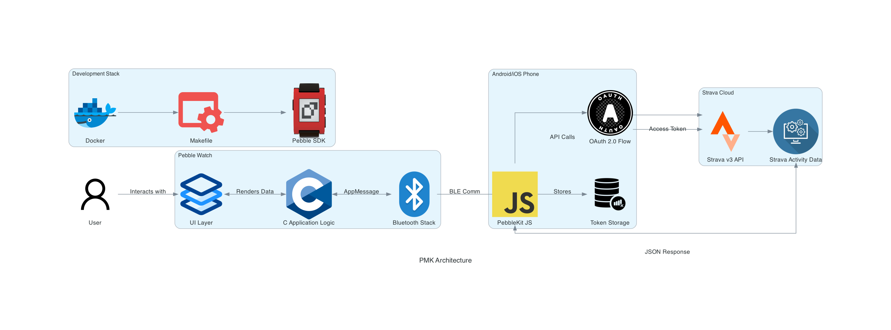
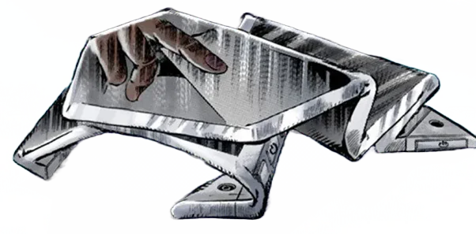

[](https://github.com/gongahkia/pmk/releases/tag/1.0.0) 

# `PMK`

A Strava application for your [Pebble](https://en.wikipedia.org/wiki/Pebble_(watch)) *(now [(re)Pebble](https://repebble.com/))* watch.

`PMK` securely integrates with [Strava API](https://developers.strava.com/) via [OAuth 2.0](https://oauth.net/2/) to render user's Strava activity data, fetched and displayed [every 15 minutes](https://developers.strava.com/docs/rate-limits/).

## Stack

* *Script*: [C](https://www.learn-c.org/), [JavaScript](https://developer.mozilla.org/en-US/docs/Web/JavaScript)
* *Auth*: [OAuth 2.0](https://oauth.net/2/)
* *Package*: [Docker](https://www.docker.com/)
* *SDK*: [Pebble SDK](https://developer.rebble.io/developer.pebble.com/sdk/index.html), [PebbleKit JS](https://developer.rebble.io/developer.pebble.com/guides/communication/using-pebblekit-js/index.html), [Pebble Emulator](https://developer.rebble.io/developer.pebble.com/blog/2015/01/30/Development-Of-The-Pebble-Emulator/index.html) (provisioned by [Rebble](https://rebble.io/))
* *API*: [Strava API](https://developers.strava.com/)

## Usage

The below instructions are for locally hosting `PMK`.

1. Register and create an app at [The Strava API](https://developers.strava.com/).
2. Set the redirect URI to *pebblejs://close*.
3. Place your Client ID and Secret in a `.env` file within `./src/`.

```env
STRAVA_CLIENT_ID=XXX
STRAVA_SECRET=XXX
```

4. Execute the following.

```console
$ chmod +x entrypoint.sh
$ docker build -t pmk-em .
```

5. Then run one of the below.
    1. Run ```docker run -it --rm -v $(pwd):/pebble-app pebble-dev``` to execute a Local `PMK` Build instance.
    2. Run ```docker run -it --rm -v $(pwd):/pebble-app pebble-dev install-phone``` to build and install `PMK` on your Physical Watch.

## Architecture



## Reference

The name `PMK` is in reference to [Paper Moon King](https://jojo.fandom.com/wiki/Paper_Moon_King), the [Stand](https://jojo.fandom.com/wiki/Stand) of [Tsurugi Higashikata](https://jojo.fandom.com/wiki/Tsurugi_Higashikata) in [Part 8: JoJolion](https://jojo.fandom.com/wiki/JoJolion) of the ongoing manga series [JoJo's Bizarre Adventure](https://jojowiki.com/JoJo_Wiki).

<div align="center">
    
</div>